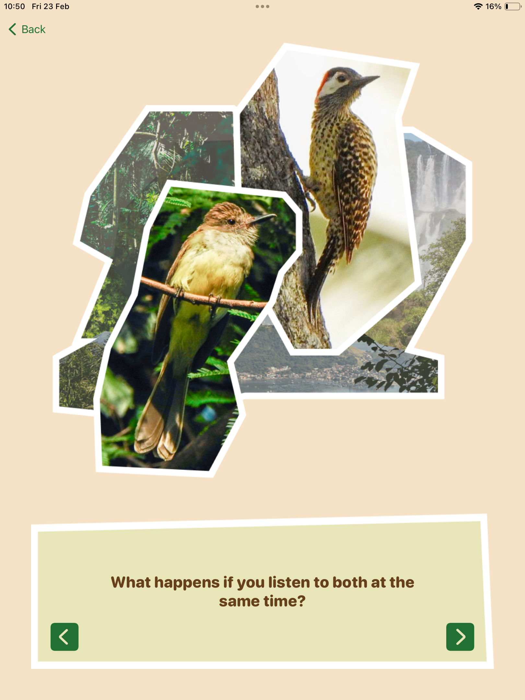
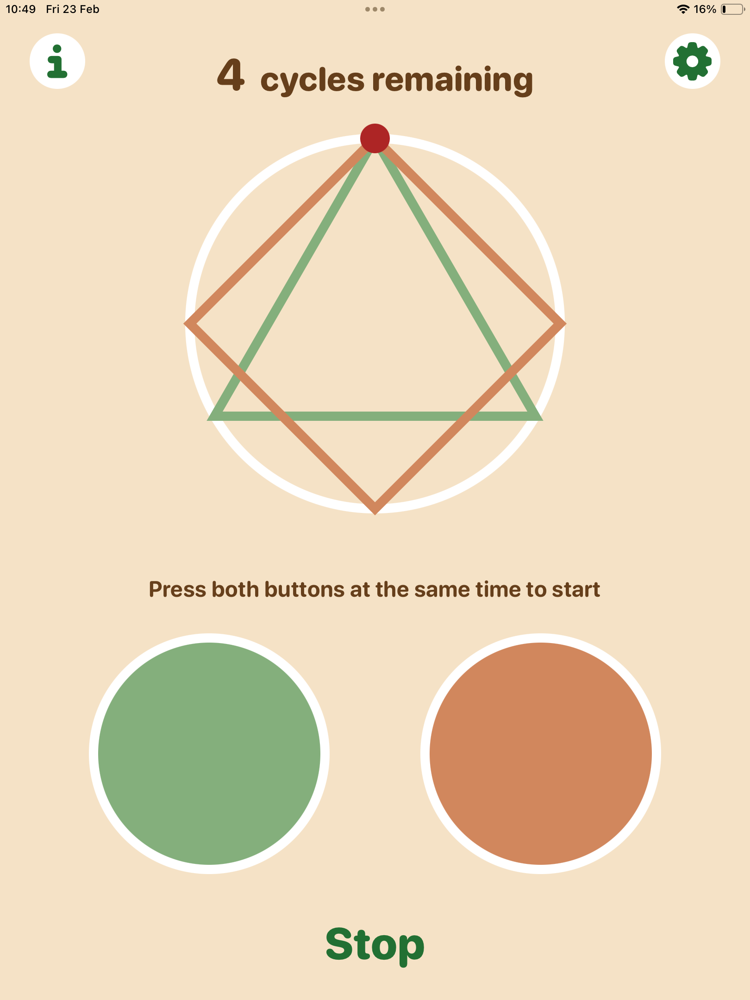
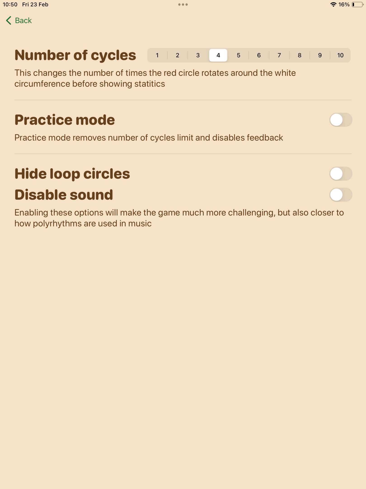

# WWDC24

Polyrhythmic is a Playground App designed for practicing polyrhythm. It was created for the WWDC24 Swift Student Challenge. The app allows you to practice various different polyrhythms at customized speeds. Additionally, there is a brief introduction at the beginning explaining the concept and relating it to nature.

